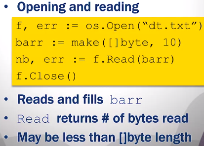
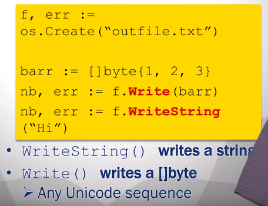

# 1. Getting Started with Go


## Module 1 Quiz

## Module 3 - Composite data types
### Arrays
Fixed-lenght series of elements of a chosen type. The elements on a array ari initializod by default to the default value of that type.
```go
var x [5]int
x[0] = 100
fmt.Println(x[4]) //0
```
Array literals, is a predefined list of values that are used to initialize an array. 
```go
var x [5]int = [5]int{1,2,3,4,5}
var x [5]int = [...]int{1,2,3,4,5}//equivalent

```
To iterate through an array.
```go
//i is the index,
//v is the value in a particular iteration,
//x is the array
for i, v := range x {
	fmt.Printf("index %d, value %d", i, v)
}
```
### Slices
A slice is a dynamically-sized, flexible view into the elements of an array.

- **Pointer:** indicates the starte of the slice. 
- **Lenght:** number of elements in the slice.
- **Capacity:** maximum number in the slice, from the start of the *slice* to the end ef the *array*.
```go
array := [...]int{1,2,3,4,5}
slice := array[1:3] //slice of array

slice2 := []int{1,2,3,4,5} //slice literal - creates the underlying array, and the slice goes from its beginning to its end
```
The function make() creates a slice with a specified capacity.
The 2 argument one is used to specify the type and capacity of the slice.
The 3 argument one is used to specify the type, lenght and capacity of the slice.
```go
slice2 := make([]int,10)
slice3 := make([]int,10,21)
```
The function append() adds elements to the end of a slice, it creates a new underlying array if the capacity is not enough.
```go
sli = append(sli, 777) //adds 777 to the end of the slice
```

### Hash Table
key/value pairs data type.
| Key  | value |
| ---- | ----- |
| Joe  | x     |
| Mary | y     |
| John | z     |

### Maps
Is the implementation of the _HashMap_ 
The function `make()` can be used to create a map.
To access the value, the key is used.
To delete a key/value pair, the function `delete()` is used.
```go
var idMap map[string]int  //string is the typo of the key, and int is the type of the value
idMap = make(map[string]int)
idMap["Joe"] = 1 //adds a key/value pair, or changes the value if the key already exists

idMap:= map[string]int{ //map literal
	"Joe": 1,
	"Mary": 2,
	"John": 3,
}

fmt.Println(idMap["Joe"]) //access the map //1

delete(idMap, "Joe") //deletes the key/value pair

id, p := idMap["Joe"] //checks if the key exists, and saves that to p as bool
len(idMap) //returns the number of key/value pairs
```
To iterate trough a map.
```go
for k, v := range idMap {
	fmt.Printf("key: %s, value: %d", k, v)
}
```

### Structs
Groups together other objects of different types
> Example: Person Struct
> 
> Name, address, phone.
```go
type Person struct {
	name string
	address string
	phone string
}

var p1 Person
p1.name = "Joe"

p2 := new(Person) //creates a struct of type Person, initializes all its fiels to their zero value.

p3 := Person(name: "Joe",
	address: "123 Main St",
	phone: "555-555") //initializing witha a struct literal
```
## Module 4 - Protocols and formats
### RFCs
Requests for comments(RFC)
| Examples |                                  |
| -------- | -------------------------------- |
| HTML     | Hypertext Markup Language 1866   |
| URI      | Uniform resource identifier 3986 |
| HTTP     | Hypertext Transfer Protocol 2616 |

Protocol packages
- Go provides packages for the most important protocols.
  - net/http > Web communication protocol `http.Get(www.google.com)`
  - net > TCP/IP communication protocol `net.Dial("tcp", "uci.edu:80")`
- Function that encode and decode protocol format.
  - JSON > RFC 7159 (attribute-value pairs) `{"name":"Mary","age":"19"}`
### JSON
Properties
- All UNICODE
- Human readable
- Fairly compact representation
- Types can be combined recursively
  - Array of structs
  - Strinct of structs

Json Marshalling > Generating a JSON representation from an object.
`Marshal()` returns JSON rerpsentation as `[]byte`
`Unmarshal()` returns an object from a JSON  `[]byte` representation.
```go
p1:= Person(name: "Joe", address: "123 Main St", phone: "555-555")
var p2  Person
	
barr,err:=json.Marshal(p1)

err:= json.Unmarshal(barr, &p2)
```


### ioutil -File access
- Linear access, NOT random access
  - Mechanical delay
- Basic operations
  1. Open - get handle for access
  2. Read - read bytes into []byte
  3. Write - write []byte into file
  4. Close - release handle
  5. Seek - move read/write head

Packages
- "io/ioutil" > basic functions
  ```go
  dat,e:= ioutil.ReadFile("file.txt")
  //dat is []byte with the contents of the entire file
  //opening and closing is not needed
  //large file may cause problems
  dat2 = "Hello World"
  ioutil.WriteFile("file.txt", dat2, 0777)
  //Arguments are: the name of file, the []byte to write, and the permissions
  ```
- "os" > Offers more control
  ```go
  os.Open() //opens a file
  //returns a file descriptor

  os.Close() //closes a file

  os.Read() //reads from a file into a []byte
  //the amount of bytes read, can be controlled by how big is the []byte passed as argument
  os.Write() //writes []byte into a file
  ```
  
  


# 2. Functions, Methods, and Interfaces in Go

## Module 1 - Functions and Organization
Functions are set of instructions with a name. These provides a way to reuse code. Functions can hide details of implementation, and can be used to create abstractions. Funtions also help to improve understandability, specially when nome appropriately.

```go
func main(){
	findPupil()
}
func findPupil(){
	grabImage()
	filterImage()
	findEllipses()
}
```
### Parameters and return values
Parameters are the input data needed to perform an operation. These are listen in parenthesis after the function name.
```go
//declaration
func multiply(x int, y int /**parameters*/){
	fmt.Println(x * y)
}
//call
multiply(2,3 /**argumments*/)
```
Functions can return a value as a result of the operation. The return type is specified after the parenthesis of the function declaration.
```go
func multiply(x int, y int) int /**return type is int*/{
	return x * y
}
a := multiply(2,3)
```
Functions in GO can have multiple return values.
```go
func increase(x int) (int, int) /**return type is int*/{
	return x , x + 1
}
a,b := increase(2)
```

### Calling function by value or by reference
By Value
- Passed arguments are copied parameters
- Modifying parameters has no effect outside the function.
- Advantages
  - data encapsulation
- Disadvatages
  - To copy large data structures can be expensive
By Reference
- Passing a pointer as argunment
- The function has direct acces to the variable in memory
- Advatages
  - Faster, as it is not needed to create copies of variables
- Disadvantages
  - No data encapsulation
```go
//by value
func foo (y int){//takes an integer as argument
	y = y + 1
}
func main(){
	x := 1
	foo(x)
	fmt.Println(x)
}
//by reference
func foo (y *int){//takes a pointer of integer as argument
	*y = *y + 1
}
func main(){
	x := 1
	foo(&x)
	fmt.Println(x)
}
```
## Module 2 - Function types
### First-Call values
Functions on GO are first-class. 
- Functions can be treated as any other type.
- Variables con be of type function.
- Can be created dynamically
- Can be stored in a data structure
```go
//declare variable of type function
var f func(int) int
//some other function
func addOne(x int) int{
	return x + 1
}
func main(){
	f = addOne //no parenthesis
	fmt.Println(f(1))
}
```
- Functions can be passed as arguments
```go
func applyFunction(f func (int) int, x int) int{
	return f(x)
}
func main(){
	fmt.Println(applyFunction(addOne, 1))
}
```	
- Anonymous functions
```go
v := applyIt(func (x int) int {return x+1}, 2)
```
### Returning functions
Functions can return functions.
When functions are passe/returned, their environment comes with them.
### Variadic and Deferred
Variable number of arguments, the arguments are treated as slice inside the function.
```go
func getMax(values ...int)int{
	max:=0
	for _,v := range values{
		if v > max{
			max = v
		}
	}
	return max
}
getMax(1,2,3,4,5,6,7,8,9,10)

//a slice can be passed, but ...needs fo follow the name of the slice.
slice:=[]int{1,2,3}
getMax(slice...)
```
Function calls can be deferred until the sorrounding function completes. usally used for clean up activities.
```go
func main (){
	i:=1
	defer fmt.Println(i+1)
	i++
	fmt.Print(i)
}
```

## Module 3 - Object orientation en GO

## Module 4 - Interfaces for abstraction