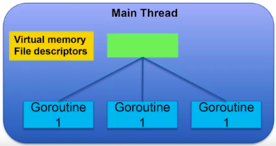

# 1. Getting Started with Go


## Module 1 Quiz

## Module 3 - Composite data types
### Arrays
Fixed-lenght series of elements of a chosen type. The elements on a array ari initializod by default to the default value of that type.
```go
var x [5]int
x[0] = 100
fmt.Println(x[4]) //0
```
Array literals, is a predefined list of values that are used to initialize an array. 
```go
var x [5]int = [5]int{1,2,3,4,5}
var x [5]int = [...]int{1,2,3,4,5}//equivalent

```
To iterate through an array.
```go
//i is the index,
//v is the value in a particular iteration,
//x is the array
for i, v := range x {
	fmt.Printf("index %d, value %d", i, v)
}
```
### Slices
A slice is a dynamically-sized, flexible view into the elements of an array.

- **Pointer:** indicates the starte of the slice. 
- **Lenght:** number of elements in the slice.
- **Capacity:** maximum number in the slice, from the start of the *slice* to the end ef the *array*.
```go
array := [...]int{1,2,3,4,5}
slice := array[1:3] //slice of array

slice2 := []int{1,2,3,4,5} //slice literal - creates the underlying array, and the slice goes from its beginning to its end
```
The function make() creates a slice with a specified capacity.
The 2 argument one is used to specify the type and capacity of the slice.
The 3 argument one is used to specify the type, lenght and capacity of the slice.
```go
slice2 := make([]int,10)
slice3 := make([]int,10,21)
```
The function append() adds elements to the end of a slice, it creates a new underlying array if the capacity is not enough.
```go
sli = append(sli, 777) //adds 777 to the end of the slice
```

### Hash Table
key/value pairs data type.
| Key  | value |
| ---- | ----- |
| Joe  | x     |
| Mary | y     |
| John | z     |

### Maps
Is the implementation of the _HashMap_ 
The function `make()` can be used to create a map.
To access the value, the key is used.
To delete a key/value pair, the function `delete()` is used.
```go
var idMap map[string]int  //string is the typo of the key, and int is the type of the value
idMap = make(map[string]int)
idMap["Joe"] = 1 //adds a key/value pair, or changes the value if the key already exists

idMap:= map[string]int{ //map literal
	"Joe": 1,
	"Mary": 2,
	"John": 3,
}

fmt.Println(idMap["Joe"]) //access the map //1

delete(idMap, "Joe") //deletes the key/value pair

id, p := idMap["Joe"] //checks if the key exists, and saves that to p as bool
len(idMap) //returns the number of key/value pairs
```
To iterate trough a map.
```go
for k, v := range idMap {
	fmt.Printf("key: %s, value: %d", k, v)
}
```

### Structs
Groups together other objects of different types
> Example: Person Struct
> 
> Name, address, phone.
```go
type Person struct {
	name string
	address string
	phone string
}

var p1 Person
p1.name = "Joe"

p2 := new(Person) //creates a struct of type Person, initializes all its fiels to their zero value.

p3 := Person(name: "Joe",
	address: "123 Main St",
	phone: "555-555") //initializing witha a struct literal
```
## Module 4 - Protocols and formats
### RFCs
Requests for comments(RFC)
| Examples |                                  |
| -------- | -------------------------------- |
| HTML     | Hypertext Markup Language 1866   |
| URI      | Uniform resource identifier 3986 |
| HTTP     | Hypertext Transfer Protocol 2616 |

Protocol packages
- Go provides packages for the most important protocols.
  - net/http > Web communication protocol `http.Get(www.google.com)`
  - net > TCP/IP communication protocol `net.Dial("tcp", "uci.edu:80")`
- Function that encode and decode protocol format.
  - JSON > RFC 7159 (attribute-value pairs) `{"name":"Mary","age":"19"}`
### JSON
Properties
- All UNICODE
- Human readable
- Fairly compact representation
- Types can be combined recursively
  - Array of structs
  - Strinct of structs

Json Marshalling > Generating a JSON representation from an object.
`Marshal()` returns JSON rerpsentation as `[]byte`
`Unmarshal()` returns an object from a JSON  `[]byte` representation.
```go
p1:= Person(name: "Joe", address: "123 Main St", phone: "555-555")
var p2  Person
	
barr,err:=json.Marshal(p1)

err:= json.Unmarshal(barr, &p2)
```


### ioutil -File access
- Linear access, NOT random access
  - Mechanical delay
- Basic operations
  1. Open - get handle for access
  2. Read - read bytes into []byte
  3. Write - write []byte into file
  4. Close - release handle
  5. Seek - move read/write head

Packages
- "io/ioutil" > basic functions
  ```go
  dat,e:= ioutil.ReadFile("file.txt")
  //dat is []byte with the contents of the entire file
  //opening and closing is not needed
  //large file may cause problems
  dat2 = "Hello World"
  ioutil.WriteFile("file.txt", dat2, 0777)
  //Arguments are: the name of file, the []byte to write, and the permissions
  ```
- "os" > Offers more control
  ```go
  os.Open() //opens a file
  //returns a file descriptor

  os.Close() //closes a file

  os.Read() //reads from a file into a []byte
  //the amount of bytes read, can be controlled by how big is the []byte passed as argument
  os.Write() //writes []byte into a file
  ```
  
  


# 2. Functions, Methods, and Interfaces in Go

## Module 1 - Functions and Organization
Functions are set of instructions with a name. These provides a way to reuse code. Functions can hide details of implementation, and can be used to create abstractions. Funtions also help to improve understandability, specially when nome appropriately.

```go
func main(){
	findPupil()
}
func findPupil(){
	grabImage()
	filterImage()
	findEllipses()
}
```
### Parameters and return values
Parameters are the input data needed to perform an operation. These are listen in parenthesis after the function name.
```go
//declaration
func multiply(x int, y int /**parameters*/){
	fmt.Println(x * y)
}
//call
multiply(2,3 /**argumments*/)
```
Functions can return a value as a result of the operation. The return type is specified after the parenthesis of the function declaration.
```go
func multiply(x int, y int) int /**return type is int*/{
	return x * y
}
a := multiply(2,3)
```
Functions in GO can have multiple return values.
```go
func increase(x int) (int, int) /**return type is int*/{
	return x , x + 1
}
a,b := increase(2)
```

### Calling function by value or by reference
By Value
- Passed arguments are copied parameters
- Modifying parameters has no effect outside the function.
- Advantages
  - data encapsulation
- Disadvatages
  - To copy large data structures can be expensive
By Reference
- Passing a pointer as argunment
- The function has direct acces to the variable in memory
- Advatages
  - Faster, as it is not needed to create copies of variables
- Disadvantages
  - No data encapsulation
```go
//by value
func foo (y int){//takes an integer as argument
	y = y + 1
}
func main(){
	x := 1
	foo(x)
	fmt.Println(x)
}
//by reference
func foo (y *int){//takes a pointer of integer as argument
	*y = *y + 1
}
func main(){
	x := 1
	foo(&x)
	fmt.Println(x)
}
```
## Module 2 - Function types
### First-Call values
Functions on GO are first-class. 
- Functions can be treated as any other type.
- Variables con be of type function.
- Can be created dynamically
- Can be stored in a data structure
```go
//declare variable of type function
var f func(int) int
//some other function
func addOne(x int) int{
	return x + 1
}
func main(){
	f = addOne //no parenthesis
	fmt.Println(f(1))
}
```
- Functions can be passed as arguments
```go
func applyFunction(f func (int) int, x int) int{
	return f(x)
}
func main(){
	fmt.Println(applyFunction(addOne, 1))
}
```	
- Anonymous functions
```go
v := applyIt(func (x int) int {return x+1}, 2)
```
### Returning functions
Functions can return functions.
When functions are passe/returned, their environment comes with them.
### Variadic and Deferred
Variable number of arguments, the arguments are treated as slice inside the function.
```go
func getMax(values ...int)int{
	max:=0
	for _,v := range values{
		if v > max{
			max = v
		}
	}
	return max
}
getMax(1,2,3,4,5,6,7,8,9,10)

//a slice can be passed, but ...needs fo follow the name of the slice.
slice:=[]int{1,2,3}
getMax(slice...)
```
Function calls can be deferred until the sorrounding function completes. usally used for clean up activities.
```go
func main (){
	i:=1
	defer fmt.Println(i+1)
	i++
	fmt.Print(i)
}
```

## Module 3 - Object orientation en GO
### Clases and encapsulation
- Classes are a collection of fields and functions that share a well defined resposability. Classes are a template, cotain data field, not actual data.
- Objects are instances of a class and contain actual data.
- Encapsulation makes so that the data can only be accesed by using method, in turn this makes it easy to guarantee data consistency.

Support for classes in GO
 - There is no "class" keyword in GO.
 - Method can have a receiver type,to indicate that they are associated with a Type.
 - Dot notation can be used to call methods related with a type. 
 	- ```go
		type MyInt int
		func (mi MyInt) double() int{
			return int (mi*2)
		}
		func main(){
			v:=MyInt(2)
			fmt.Println(v.double())
		}
		```
 - Method associated with a type have an implicit first argument.
 - Pointer receivers (to modify the object implicitly passed tho the function)
   - ```go
		func (p *Point) Offset(v float64){
				px = px + v
		}
		```
### Point recivers, referencing, dereferencing.
No need to reference or dereference when using pointer receivers.

## Module 4 - Interfaces for abstraction
### Polymorphism
- Is the ability for an object to have diferent "forms" dependisc on the context
- Identical at a hing level of abstraction, and different at a low level of abstraction.


Interfaces
- Set of method signatures
  - Name paramenters, return values.
  - Implementation is not defined.
  - Expresses a conceptual similarity between types.

Defining an iterface
```go
type Shape interface{
	Area() float64
	Perimeter() float64
}
type Triangle {...}
func (t Triangle) Area() float64 {...}
```
### Type Assertions
Disambiguate between types that implement the same interface.
```go
func Draw2DShape(s Shape2D){
	switch shape:=s.(type){
		case Rectangle:
			drawRect(shape)
		case Triangle:
			drawTriangle(shape)
	}
}
```
### Error handling
Many go programs return error interface
```go
type error interface{ Error() string }
```
If there is no error then "error==nil" otherwise, error would indicate the actual error.

# 3. Concurrency in GO

## Module 1 - Why use concurrency?

### Parallel execution
> Parallel execution is not the same as concurrency

- Happens when two programs execute in at exactly the same time. 1 core of the cpu runs 1 instruction at a time.
- Tasks may complete more quickly.
- Not all tasks are parallelizable.

### Von Neumann Bottleneck

> Moore's Law - Prodictod transistor densitiy would double every two years.
(not an actual law, just an observation)

### Power wall


### Concurrent execution
- Happens when two programs execute in overlapping time periods, but these are not executing at the same time.

- Concurrent tasks may be executed on the same hardware.
- In GO mapping from tasks to hardware is not directly controlled by the programmer.

- Hiding Latency
  - Concurrency gan improve performance even without parallelism.
  - As tasks must periodically wait for I/O, memory access, etc..., other concurrent tasks can be processed while the other task is waiting.
  - )

## Module 2 - Concurrency basics

### Processes
- A process is an instance of a program that is being executed.
- A process may have
  1. Memory
     1. Virtual address space
     2. Code, stack, heap, shared libraries, etc...
  2. Registers
     1. Program counter
     2. Data Regs
     3. Stack pointer

Operating Systems
- Allow many processes to execute concurrently.
- Provide fair access to resorces
- Scheduling
  - Gives the illusion of parallel execution.
- **Goroutines**
  - Are like threads but in GO
  - Many Goroutines execute within a single OS thread.
   
- **Interleavings**
  - Order of execution within a task is known, but the order of execution **between** concurrent tasks is *not* known.
  - Interleaving of instructions between tasks is unknown.
    - Many interleavings are possible.
    - Programmer must consider all possibilities.
    - Ordering is non-deterministic.
  - Race conditions
    - Outcome depends on non-deterministic ordering.
    - Races occur due to **communication**.
  - Threads are not completele independent

## Module 3 - Threads in GO
- Creating goroutines
  - One goroutine is created automatically to execute the `main()` function.
  - Other goroutines con be created using the `go` keyword.
	```go
	func main(){
		a:=1
		go foo()
		fmt.Println("World")
	}
	```
- Exiting goroutines
  - A gourutine exits when its code is complete.
  - When the __main__ goroutine is complete, all ather goroutins exit.
  - 

> Adding a delay to wait for a goroutine is bad! Time asumptions may be completely wrong.

### Synchronization
Using __global events__ whose execution is viewed by all threads, symultaneously.


Sync WaitGroup
- `sync.WaitGroup` is a synchronization primitive, that forces a goroutine to wait for other goroutines to complete.
- Contiains an internal counter. the counter is decreased each time a goroutien completes.
- 

Goroutine communication
- Goroutines usually work together to perform a bigger task.
Channels
- Transfer data botwees goroutines.
- Chanels are typed, and can only transfer data of that type.
- `make()` is used to create a channel.
  - ```go
		ch:=make(chan int)
    ```
- Are used to recive and send data.
  - ```go
		ch<-1 //send data on channel
		x:=<-ch //recive data from channel
	 ```
Example
```go
func prod(v1 int, v2 int, c chan int){
	c<-v1*v2
}
func main(){
	c:=make(chan int)
	go prod(1,2,c)
	go prod(3,4,c)
	a:=<-c
	b:=<-c
	fmt.Println(a*b)
}
```
### Unbuffered channels
- Unbuffered channels cannot hold data in transit.
- 
- This type of channel is also doing syncronization.

### Buffered channels
- Channels can contain a limited number of objects. By default is 0 (unbuffered).
- Optional argument in `make()`
- 
- Buffer will not block, unless is full.
- 


## Module 4 - Syncronized communication
### Iterating through a channel
- It is commen to iteratively read from a channel; one iteration each time a new value is received.
  ```go
  for v:=range ch{
	 fmt.Println(v)
  }
  ```
- The cycle will continue until close is called on the channel. `close(ch)`
- Data may also be received from multiple channels.

### Select statement
Choice on which data to use, when multiple channels are available.
- First-come-first-served
  - Waits on the first data from a set of channels.
  - ```go
		select{
			case v:=<-ch1:
				fmt.Println(v)
			case v:=<-ch2:
				fmt.Println(v)
		}
    ```
  - Select may be used to select either send or receive operations.
  - ```go
    select{
		case a = <- inchan:
			fmt.Println("Roceived a")
		case b <- inchan:
			fmt.Println("Sent b")
    }
    ```
  - Select with an abort channel
  - ```go
    for{
		select{
			case v:=<-ch1:
				fmt.Println(v)
			case <-abort: //abort is a different channel, and as soon a it gots some data, the for loop will stop.
				return
		}
	 }
	 ```
  - If the `select` statement contains a default case, it will not block, if non of the other cases are ready.

### Mutual exclusion
Sharing variables concurrently may cause problems, If two or more goroutines are writing to a shared variable, they may interfere with each other.

A function can be **"Concurrency-Safe"** when a function can be invoked without interfering with other goroutines.

### Mutex
DO NOT let 2 goroutines write a shared variable at the same time.
Writing to shared variables should be mutually exclusive. That means that some code segmentes en different goroutiens should not execute concurrently

- Methods
  - `Lock()` sets the flag up
    - The shared variable is in use.
    - If the variable is locked by a goroutine, other goroutines cannot use that shared varible, until the lock goes down.
  - `Unlock()` sets the flag down
	 - The shared variable is not in use.
	 - Other goroutines can use the shared variable.
  - ```go
    var i int = 0
    var mut sync.Mutex
    func inc(){
		mut.Lock()
		i++
		mut.Unlock()
    }
    ```


### Once syncronization
Syncronous Inizialization
- Must only happen once
- Must happen before everything else
- Package Sync.Once
  - Has one method, `once.Do(f)`
  - The function `f` is executed only one time, even if it is called on multiple goroutines.
  - All calls to `once.Do(f)` will block until the first returns. That way initialization is is ensured.
  - ```go
    var wg sync.WaitGroup
	 var on sync.Once
	 func main(){
		wg.Add(2)
		go doStuff()
		go doStuff()
		wg.Wait()
	 }
    func doStuff(){
		on.Do(setup)
		fmt.Println("Doing stuff")
		wg.Done()
	 }
	 func setup(){
		fmt.Println("Init")
	 }
    ```
  - 

### DeadLock
Cicular dependencies cause all involved goroutines to block.
> G1 waits for G2, and G2 is also waiting for G1.
> 
Example:

Deteccion of deadlock


# GetGoIng

## DataTypes
- Atomic data types
  - string
  - int
  - int32
  - int64
  - uint
  - uint32
  - uint64
- unsafe
  - Pointers
- Abstract data types
  - map[]<datatype>
  - struct{}
  - interface{}

## Declare variables and constants
```go
//constants
const name = "OppositeDragon"
//one variable
var num1 int
num1 = 5
var someNumber = "15" 
//multiple variables
var (num2, num3) int
var (
	num4 = 5,
	num5 = 6
	)
//short declaration with assignment
num6 := 5

//Cancatenate
fmt.Println("Hello",name)
```
### Casting
```go
var num1 int = 5
var num2 float64 = 5.5

float64(num1) + num2
```
### Printf
[printf documentation](https://pkg.go.dev/fmt#hdr-Printing)
```go
fmt.Printf("Hello %v",name)
```


### Getting input from the user
```go
var name string
fmt.Scanln(&name)
```